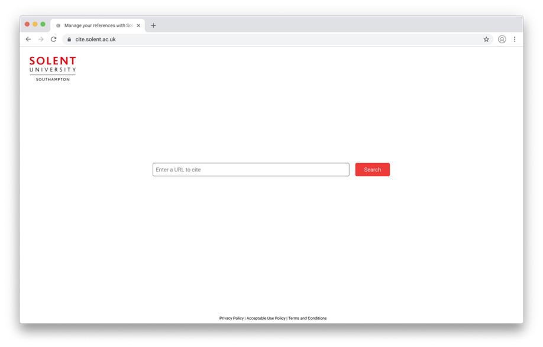
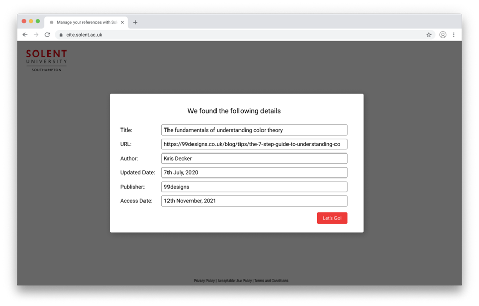
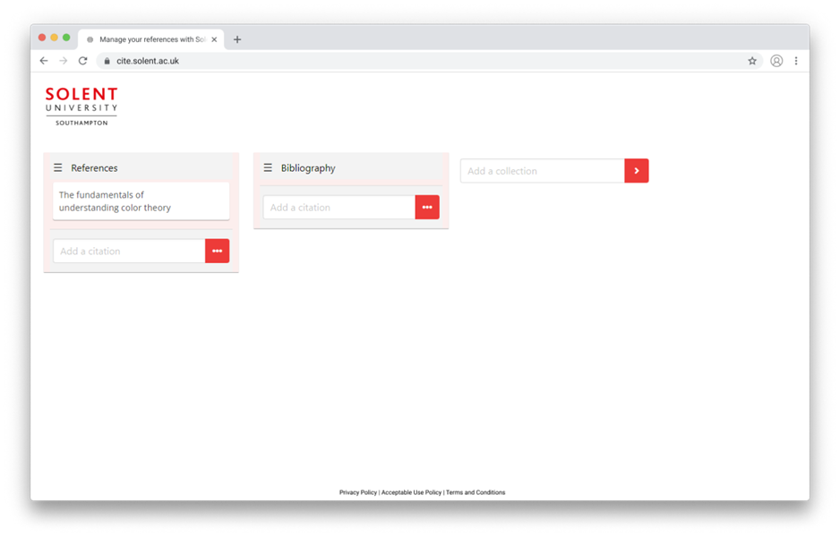
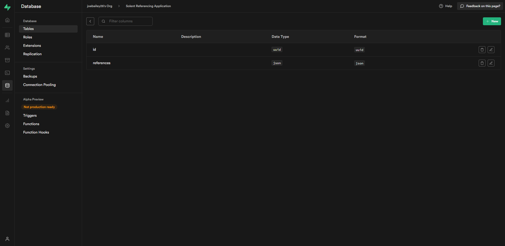
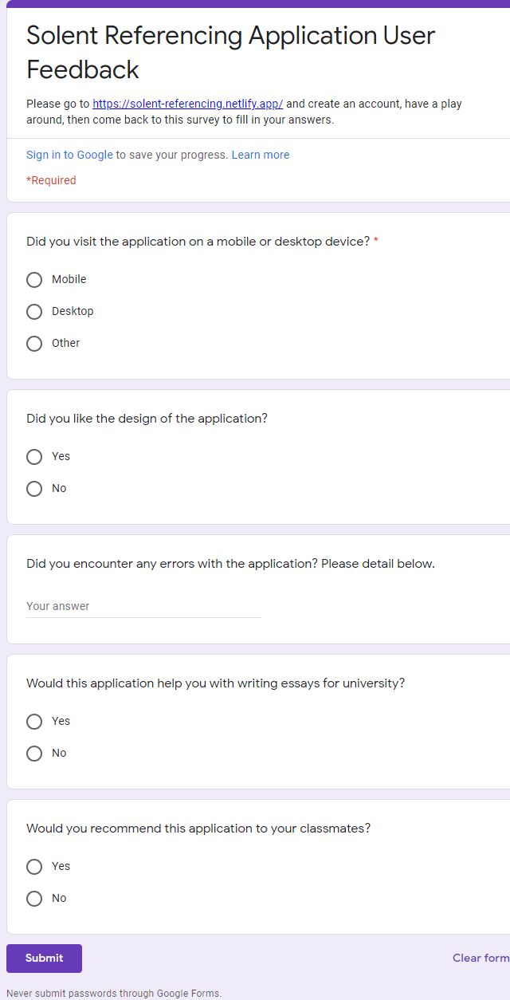
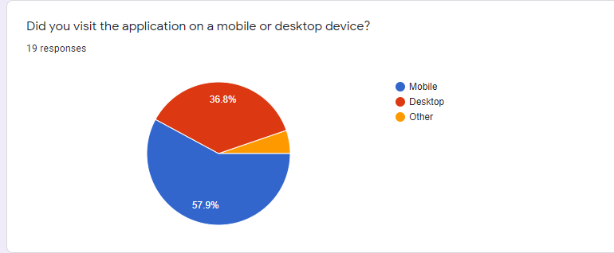
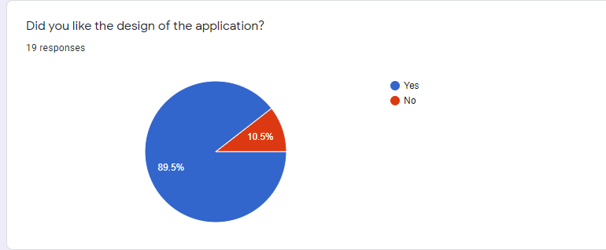
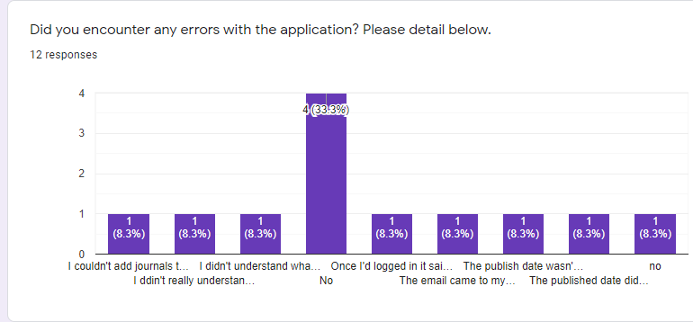
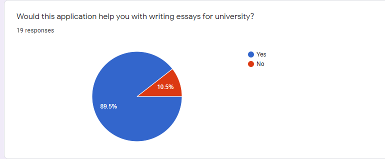
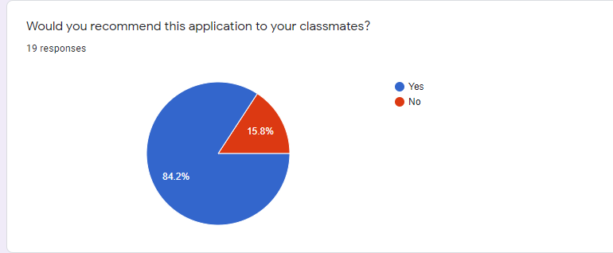

# Solent Referencing Application Documentation

> An application to help students reference

Joseph Bailey (Q14133407)

[Website](https://solent-referencing.netlify.app/)

[GitHub](https://github.com/joebailey26/solent-referencing)

## Introduction

Through our separate research, we have discovered that Solent students are struggling with referencing in their assessments.

This project set out to create an application allowing students to paste in a website URL and get back a reference ready for use in their university assessment. The application goes one step further allowing users to create an account and manage their references in one place. The application is built using front-end technologies on a Jamstack architecture. The user interface is built using [Nuxt](https://nuxtjs.org/) whilst user authentication and persistent storage is managed with [Supabase](https://supabase.com/). The application is hosted with [Netlify](https://www.netlify.com/) and uses [Netlify Functions](https://www.netlify.com/products/functions/) to send data to Supabase.

Initial mockups can be seen below.





## Choosing the front end technologies

### Vue Vs React

Vue has a smaller package size and a quicker compiler when [compared to](https://stefankrause.net/js-frameworks-benchmark8/table.html) React. For this small project and for the sake of the students using it, speed is key. When Vue is partnered with Nuxt, extremely performant Server Side Rendered (SSR) sites can be created very quickly. Developer Experience (DX) plays a big part in the decision of high-level managers when choosing a framework, [some might say it plays too big a part](https://www.industrialempathy.com/posts/developer-experience-and-user-experience/). Nuxt has a great Command Line Interface (CLI) tool for prototyping applications rapidly. It also has a very refined folder structure which makes it easy to organise pages, layouts, plugins, and the Vuex store. Using Vue has the added benefit of segmenting out your HTML, CSS, and JavaScript which separates markup from styles from logic which is how the web works in its bare form. React on the other hand tries to combine all 3 into pure JavaScript sometimes making for hard to read code for developers that are new to the codebase. There are many articles that discuss the pros and cons of both React and Vue, however, [this may be one of the best](https://dev.to/jeremyling/5-things-i-struggled-with-when-learning-react-with-a-vue-background-1fed).

### Website Hosting

In recent years, Netlify has massively dominated the Jamstack hosting market with a host of features and its ease-of-use, it's no wonder developers are [flocking to the platform](https://www.netlify.com/press/after-onboarding-800000-developers-netlify-raises-53m-in-series-c-funding-to-fuel-enterprise-growth). In its simplest form, you can drag and drop a zip file of your website and Netlify will host it. No need to worry about domains, a Content Delivery Network, cache, Apache, Nginx, etc. Some of their more advanced offerings include Authentication, Databases, Large File Storage, and Functions. Many of these advanced features come with a cost. Netlify functions is a tool that's available on the free plan. It allows you to write JavaScript that runs on a server, aka serverless functions. The technology stack behind it is Amazon Web Services Lambda functions but Netlify has sprinkled some of their magic on top. Namely, you can place your JavaScript code inside a functions folder in your repository and Netlify will automatically parse it, and generate a URL for you to call your function from. A serverless function is particularly useful when you want to [protect an API key from prying eyes](https://dev.to/nunocpnp/protecting-api-keys-with-serverless-functions-2ck7). Including this key in your front-end code means that anyone can steal it, but with the advent of [JSON Web Tokens (JWTs)](https://jwt.io/), you can authenticate your users with your backend, and perform these potentially hazardous operations safely with no data leaks. For our use case, we're using a Netlify function to fetch a URL and scan for its metadata. At a high level, this means we'll be going to a page, scanning for the page title, author, publish date, and other values, and returning that to our student. Let's dig a little deeper into how that works on a code level. First, we import a NPM package called [Metascraper](https://metascraper.js.org/#/). This package handles scraping a webpage for us. The general rule in Web Development is don't reinvent the wheel. We then have some code that handles the request to the Netlify function, parses the request URL, sends that to Metascraper for it to fetch and then return the result back to the client.

### Authentication and Database Management

As Netlify charges for their Authentication and Database solutions, an alternate provider was needed for this university project. [Firebase](https://firebase.google.com/) is a competitor to Netlify and is popular among the Web Development community, however, is owned by Google and can sometimes over-complicate things with the introduction of [Google Cloud Platform (GCP)](https://cloud.google.com/). Supabase is a relatively new company that aims to be an open source alternative to Firebase. Another general rule in Web Development is to support Open Source as often as possible. All 3 major browser engines are Open Source which means that anyone can help to develop or can use for their own project. WordPress, which powers 30% of the internet, is an Open Source platform, which means it can be torn down to its bare components and built back up again for your use-case. Supabase has the Authentication and Database features that the Solent Referencing Application needs. The documentation is also very thorough which is a DX must. The Supabase JavaScript API is a breeze to use and is very minimal code. The last thing any codebase needs is bloat. The Supabase client is registered at the beginning of the Vuex store file so that it can be called from any action. There are Vuex actions for logging a user in and out, signing up, and syncing the citation lists with the Supabase database. The Supabase database is built on top of Postgres and can accept SQL queries. First, we set up the database with two columns, one for the user id, ```id```, which is the primary key, and a second column, ```references```, to store the array of citation lists generated by the app. In order to secure each row within the database, we used Row Level Security (RSL). This locks the database down to only allow logged in users to view and update their own citation lists. To achieve this RSL, the following SQL query was used:

```sql
create policy "Data is manageable by users who created them."
  on "user-references-data" for ALL
  using ( auth.uid() = id ) with check(auth.uid() = id);
```



## Methodology

There are many different methods when developing something. Some methods work best for teams, some for individuals but most of the time it is just down to personal preference. Two of the most common development methodologies for implementing an agile development environment are [Kanban and Scrum](https://www.atlassian.com/agile/kanban/kanban-vs-scrum). Kanban allows you to assign tasks as different priorities, such as a list of backlog tasks, to do tasks, in progress, and for review. Things can sometimes get overwhelming and hard to understand as tasks can pile up and there is no set end date for a particular task or development cycle. Scrum, on the other hand, allows one to set development sprints. These are often in periods of a week or a month and contain many small tasks or one high-level task.

Overall, [an agile development methodology is an iterative one](https://www.cprime.com/resources/what-is-agile-what-is-scrum/). Development occurs in cycles, allowing one set of features to be completed before moving on to the next one. By working in a cycle feedback can be received early on, unlike the waterfall method where it is difficult to go back up the waterfall once one step has been completed.

To develop the Solent Referencing Application, a Scrum methodology approach was taken. The first sprint consisted in scaffolding the app, creating the repository, setting up Nuxt, Netlify, Supabase, and laying out the basic pages and menu structure. The next sprint consisted of developing the logic to scrape websites for their metadata, provide that to users so that they could edit it, then assign it to a reference list and generate the correct output for entry into their essay. The final development cycle consisted of setting up Supabase to accept user signups, logins, and persist the reference list data so that a user could log in to the app from anywhere and access their references or add to them.

## Collecting Feedback

In order to properly analyse our solution, we sought real user feedback. A [Google Form](https://docs.google.com/forms/d/e/1FAIpQLScibp7HcAz3AgfUstusCtt82h29oOB9XNpeTYxUayedXwc2QQ/viewform?usp=sf_link) was used to collect quantitative data on the success of our solution. We tried very hard to ask non-biased questions and provoke thought among the respondents. [Research has shown](https://survicate.com/surveys/more-survey-respondents/) that surveys of a short length collect the most responses, so whilst this did hinder our ability to ask long questions, we did get a large sample size of answers to the questions that we did ask.





We can see that more than 55% of respondents accessed the application on a mobile device. This corresponds with [worldwide research](https://radar.cloudflare.com/) on how people access the web. The application was built in a responsive fashion to best serve all users.



Most people liked the design of the application which has taken inspiration from [Solent University's own website](https://www.solent.ac.uk/). Design is subjective, but focus groups could help define what students don't like about the current design.



A few errors were reported by users which is really good feedback on what steps to focus on next. This is discussed more in the conclusion.




Most users found the application useful and would recommend the application to their peers which suggests its use in the university could grow exponentially and be an extremely good investment by the university.

We also had one session sitting with a participant using the application for their essay. The participant is a second year student at Southampton Solent so was perfect to test out the application. They brought to attention some small errors which wouldn't have been caught otherwise. They first tried signing up, however, the application URL wasn't registered in Supabase, only the localhost, so the confirmation email they received did not work. Once they were able to login, Nuxt router tried to push the route on top of the existing page rather than at the root of the document, so they ended up seeing a 404. When generating a reference list, it didn't automatically get copied, there was no space between the author first name and last name, and there were no line breaks between each reference.

## Conclusion

Looking forward, if the project were to continue, analytics could be placed within the application itself to generate real-world data. This data would tell us the what and how of users. To go one step further, we could harvest the emails used to generate logins and send a mailer with a more qualitative survey. This will get us data on how users feel about the application and whether it is actually improving their ability to reference. We may also get feedback on needed features, which we could then implement.

In terms of the code, we would test more edge cases, such as ISO standard dates being fetched from a website which won't work in the date picker. The design could also be developed further, however, in its simple form, the UX of the app is very good meaning that the barrier of entry is very low. We would have an in-depth security review of Supabase, the database, how data is transmitted, who can access that data, and whether it's secure. We could also review the dependencies of the project and try to minimise the number used, as well as reviewing any security vulnerabilities. The authentication flow is not always seamless, with users sometimes having to refresh the page after signing in to be able to see their content. With more time, it would be prudent to explore the possibility of data polling as there would be a circumstance when a user is logged in on two devices at once, updates data on one, and the data is not updated on the other, either leaving the user confused, or as a worst case scenario they would overwrite their own changes. This could be achieved with WebSockets, but would need further research.

If the app were to continue, certain features could be added to make it a more well-rounded experience. A lot of authentication features could be added such as the ability to edit one's password and delete their account. A feature could be implemented to allow users to share their reference lists with others, providing vital collaboration tools when students work on group projects. Students often don't just reference from URLs but books, journals, and other sources. A further study of competitor programs could be conducted to build a more well-rounded citation import process.

Overall, the application can be seen as a successful proof of concept with a lot of potential for future development.
